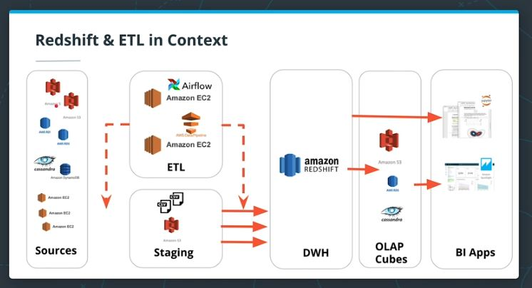
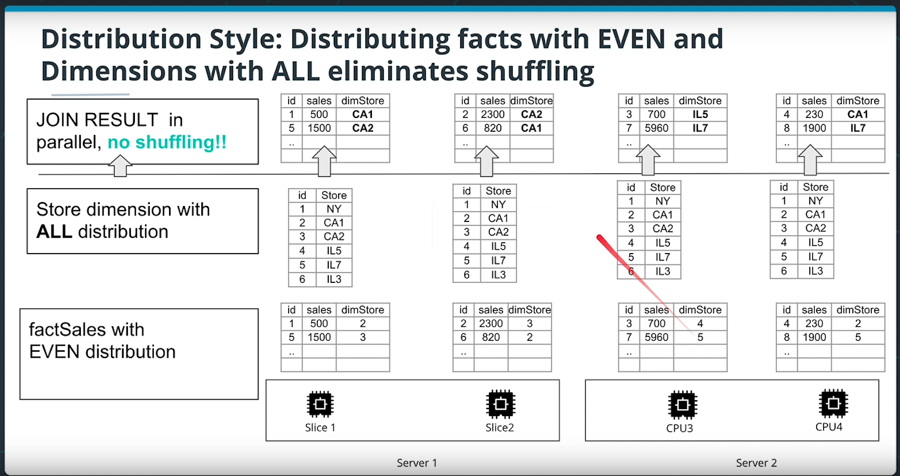
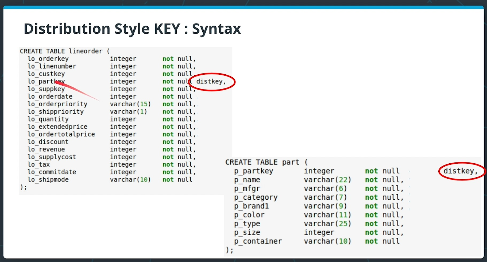

# Notes on Data Warehouse

Notes taken while taking the Udacity Data Engineering Nanodegree.

## ETL architecture

## Data Ingestion

- Ingestion should be done at scale using the **COPY** command, because inserting row by row is too slow.
- If the file is huge,
  - Splitting the file into multiple files
  - Ingest in parallel
    - Using common prefix, or
    - Using a manifest file
- Other consideration
  - Better to ingest from the same AWS region
  - Better to compress all the CSV files

## Using Redshift - Optimizing the table design

Redshift clusters have multiple nodes, so you can optimize the design of the table to ingest your data and improve its performance.

When a table is partitioned up into many pieces and distributed across slices in different machines, this is done blindly. If one has an idea about the frequent access pattern of a table, one can choose a cleverer strategy. There are 2 possible strategies:

- Distribution Style
- Sorting Key

### Distribution style

1. EVEN distribution

    With an EVEN key distribution style, a table is partitioned on slices such that each slice would have an almost equal number of records from the partitioned table. (round-robin method)

    Joining 2 tables distributed using an EVEN stategy is slow because records will be shuffled for putting together the join result.

1. ALL distribution

    Small tables could be replicated on all slices to speed up joins. And, these are used frequently for dimension tables. (a.k.a broadcasting)

    

1. AUTO distribution

    This strategy leave the decision to Redshift to decide. In general, this is what they do:

    - "Small enough" tables are distributed with an ALL distribution strategy, while
    - Large tables are distributed with EVEN strategy.

1. KEY distribution

    Rows with similar keys are put in the same slice. But, this can lead to a skewed distribution, if some dist keys are more frequent than others.

    However, when a dimension table is too huge to be distributed across ALL strategy, one can organize the distribution for both fact table and dimension table using the same dist key. (Useful trick)

    Therefore, Redshift collocates the rows from both table one the same slice, using the joining keys.

    

    

1. Sorting Key

    One can define its columns as sort key. Then, upon loading, rows are sorted before distribution to slices.

    This minimizes the query time since each node already has contiguous ranges of rows based on the sorting key.

    This is useful for columns that are frequently used in sorting like date dimension (SQL query `by`) and, its corresponding foreign key in the fact table.

    
